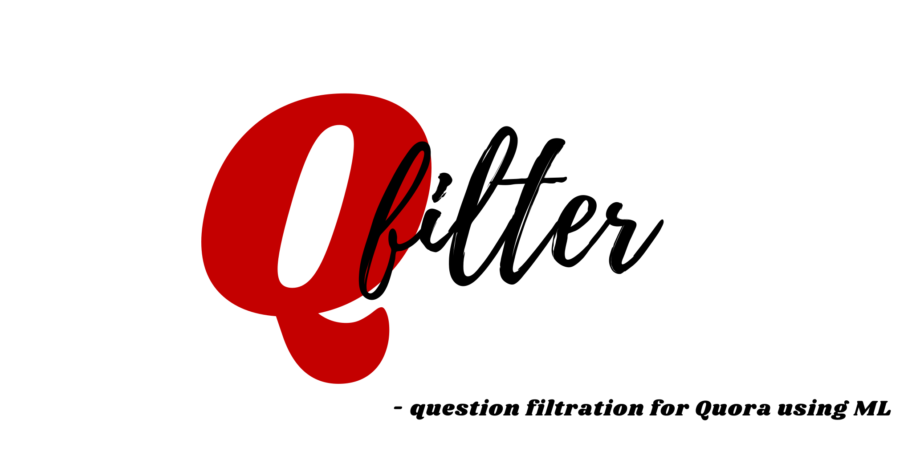

<!-- # Q-filter question filtration for Quora using ML -->

<!-- https://colab.research.google.com/drive/1lBny-BbwP-VxLX8aF-pgLo5XLz0oB-Dk?usp=sharing -->

Quora is a platform that empowers people to learn from each other. On Quora, people can ask questions and connect with others who contribute unique insights and quality answers. A key challenge is to weed out insincere questions -- those founded upon false premises, or that intend to make a statement rather than look for helpful answers. And to solve this problem our project comes to the picture. 

# Features:
- Chrome Extension that provides color flag based on the sincerity of a question at the time of posing question.
- Fix your Question Using rephrasing feature to rebuild the sentence
- Fix question by Checking sentence formation, Grammar + spell check.

<!-- - How do I marry an American woman for a Green Card? How much do they charge? -> insincere
- How do I work in cybersecurity overseas? -> sincere
- What are some best college for aircraft propulsion(M.S)? -> sincere
 -->

# Architecture:

# File Structuree:
- `./Extension`: Extension files
- `./Model`: trained models
- `SMF_api_call_response_from_ngkor_main.ipynb`: Model prediction and API call
- `Paraphrasing.ipynb`: Streamlit app
- `lstm-is-all-you-need-well-maybe-embeddings-also.ipynb`: Model training
